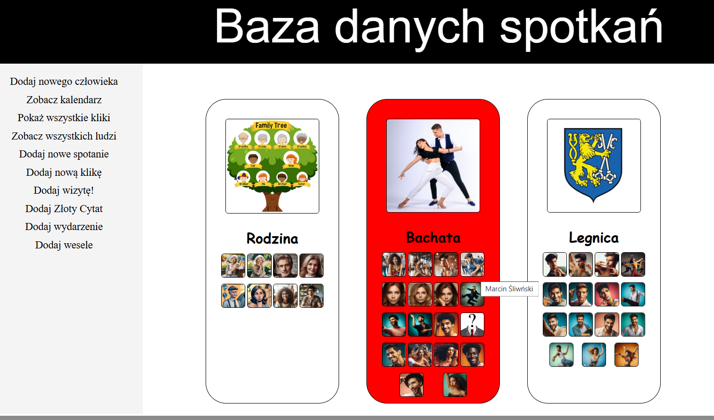
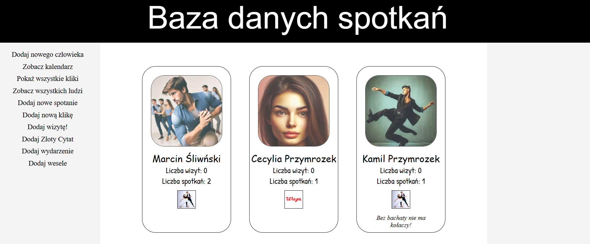
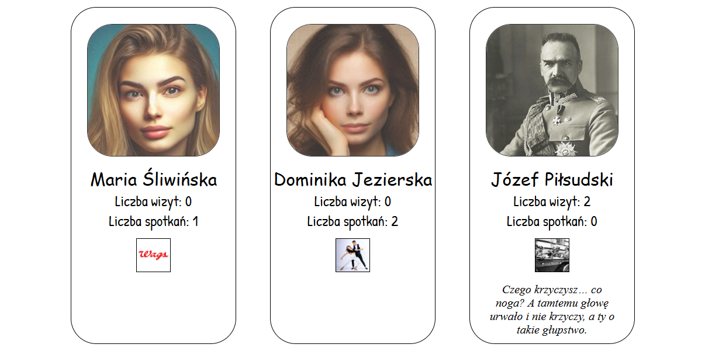
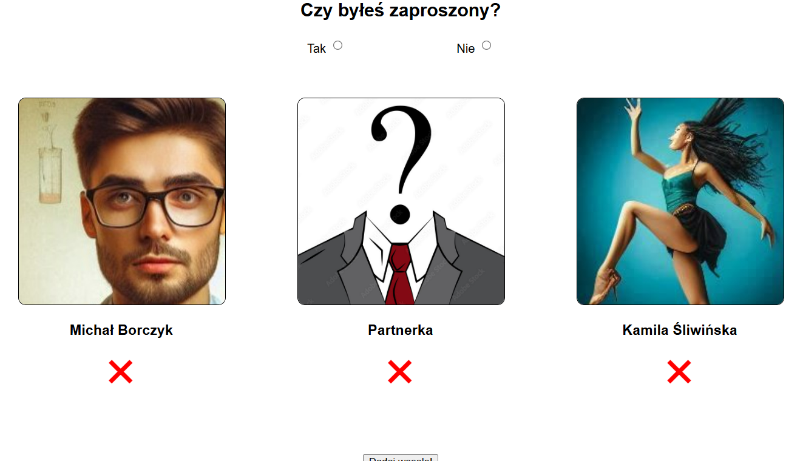
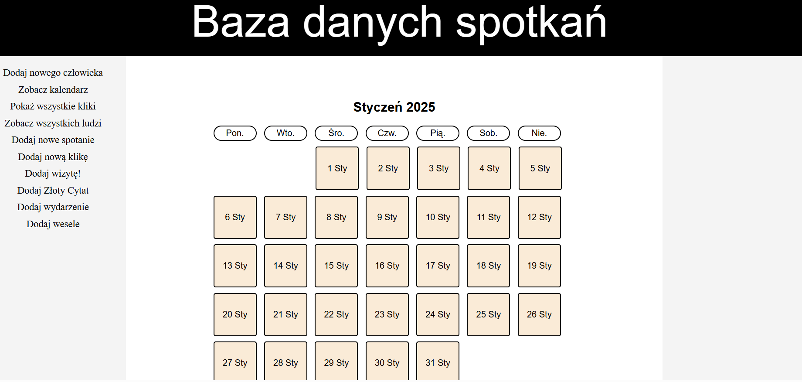

## CleanMeeter

This project is  a digital diary of mine. You can write don all the visits, meetings, events and weddings you took part in.
For a presentation purposes, I created dummy data which will be presented on a video soon.

At the moment, not all features were implemented in the refactorized version. I created some dummy data for the presentation purposes. Here I only show the finnished ones.

See all groups of your friends:

See all your freinds:

Add a wedding:

Calendar(at the moment calendar is empty, in the full version it will show al the events, visits, meetings and weddings)

## Technologies
- **Frontend**: HTML, CSS, JavaScript, planned migration to React.js
- **Backend**: Node.js, Express.js
- **Database**: MySQL
